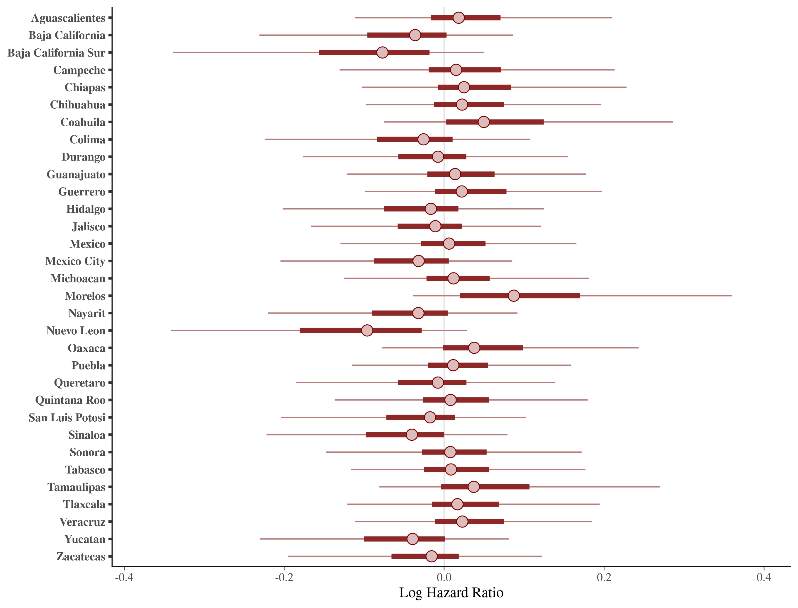

\newcommand{\N}{\mathbb{N}}
\newcommand{\Z}{\mathbb{Z}}
\newcommand{\R}{\mathbb{R}}
\newcommand{\Q}{\mathbb{Q}}
\newcommand{\vac}{\varnothing}
\newcommand{\Pro}{\mathbb{P}}
\newcommand{\var}{\text{Var}}
\newcommand{\E}{\mathbb{E}}
\newcommand{\ii}{\'{i}nez}
# Introduction

The severe acute respiratory syndrome coronavirus 2 (SARS-CoV-2) pandemic was declared a Public Health Emergency of International Concern on January 30, 2020 by the World Health Organization.The Mexican Health Authorities declared the first lockdown
on March 26 with 585 cases and 8 deaths reported for COVID-19 @Carrillo-Vega2020; by the end of the first lockdown (June 5th, 2020) total number of cases and deaths were 110,026 and 13,170, respectively. By November 1, Mexico became the fourth country in
number of deaths of SARS-CoV-19 (106,765 deaths), with 1,122,362 incident cases @OrganizacionPanamericanadelaSalud2021; by April 15th 2021 the number of deaths had raised to 214,372 with 2,309,099 incident cases @covidgob. 

Over time it has become clear that comorbidity factors such as hypertension, type 2 diabetes mellitus, obesity and smoking increase
the seriousness of the disease, lead to a higher rate of hospitalizations with an additional 25\% of the cases requiring intensive care unit (ICU) admission and ultimately, intubation and death [@SEDESA2021; @olivas2021hospital]. 

Mexico ranks second in obesity among OECD countries, with an obesity rate of 72.5\%  among the adult population, which is associated
with the high prevalence of type 2 diabetes mellitus, estimated at 13\% of the adult population in 2017, the highest rate among OECD countries; the rate of hypertension is also one of the highest chronic diseases among adult population with 30\% @OCDE2019. The high prevalence of these comorbidities together with the precarious healthcare system could be among the main reasons of the elevated severity of the number of cases and deaths rates in the country [@burki2020covid; @ji2020potential]. 

Mexican, healthcare providers are divided in public and private services. There are different public institutions which provide care to different populations: federal government employees (ISSSTE), the army (SEDENA) and navy personnel (SEMAR), workers from the state-owned oil company (PEMEX) and private companies employees (IMSS). There are also public hospitals for population with no health service coverage (SSA). In general, the care within different healthcare providers cannot be considered homogeneous, therefore it is likely relevant and informative for the final outcome of a COVID-19  patient.  

There have been many efforts using local data to understand how patients' comorbidities are affected by COVID-19; the work by   Bello-Chavolla et al. @Bello-Chavolla2020 proposed a clinical score to predict COVID-19 lethality, including different factors like
type 2 diabetes mellitus and obesity among confirmed and negative COVID-19 cases in Mexico. This work lead to believe that
obesity mediates 49.5\% of the effect of diabetes on COVID-19 lethality. Also, early-onset diabetes conferred an increased risk of hospitalization while obesity increased the risk ICU for admission and intubation. Moreover, Olivas-Mart\ii et al. @olivas2021hospital found that main risk factors associated with in-hospital death were male sex, obesity and oxygen saturation < 80% on admission using data from a SARS-CoV-2 referral center in Mexico City.

After onset of infection there is a period of time between symptom detection and hospitalization. The time elapsed before patients approach hospitals could be excessively long. Once patients are admitted to hospital, there is also a period of time between the admission and death. Estimation of these lengths of time through a multilevel model could enable a better information system to estimate incidence and transmission rates, particularly at regional level where differences can be apparent. In addition, these times are useful for estimating hospitalizations and deaths in COVID-19 epidemiological models [@flaxman2020estimating; @unwin2020state].

This work considers a multi-state model under a Bayesian framework to estimate times between symptom detection and hospitalization and between hospitalization and death. We used data of confirmed and negative COVID-19 cases and their demographic and health characteristics from the General Directorate of Epidemiology of the Mexican Ministry of Health; the analysis provides of general overview of these times in each state of the country and the different health institutions within. Variables believed to affect the patient's final outcome such as the aforementioned comorbidites are included in the model as fixed effects. Additionally, regional heterogeneity is accounted for as random effects through nested models that consider the regional contribution and the healthcare service provider. Other efforts in recent literature @Kirwan have considered more states (hospitalization-ICU, ICU-death, ICU-discharged), which allows researchers to asses whether improvements in patient outcomes have been sustained, finding evidence that median hospital stays have lengthened. Unfortunately, data available for Mexico lacks the necessary granularity to determine such states. Nevertheless, we believe this model could better inform the estimation of the  incidence and transmission rates, which is  particularly important while new variants and increased transmission rates are present.


# Methods and materials

## Data Source and Study Population

We conducted an observation study using the official database from the Mexican Ministry of Health, these data provide an overview of hospital admissions, deaths and the period of time between hospitalizations and first COVID-19 symptoms between March and January 2020. The data analyzed included confirmed individuals with a positive test for SARS-CoV-2 @covidgob; in late 2020, the Mexican Ministry of Health change its confirmed definition with the objective of including postmortem cases. The information recorded on every individual includes: sex, age, nationality, place of residence, migratory status, and different comorbidites. Data registered on the COVID-19 event includes: type of first contact medical unit, management received (either hospitalization or outpatient), and dates of onset of COVID-19 symptoms, admission to hospitalization, and death. Data on the evolution during the stay in the medical units were not released for public use, such as date of recovery. Exclusion criteria were the observations with incomplete data about hospital admission, symptoms or comorbidities. Additionally, patients whose time of initial symptoms was captured as the day they were admitted to hospital were removed, since this time was likely to be unknown. Finally, we only included patients who experienced either hospitalization or death  due to the lack of date of recovery in the dataset.

The following variables were included as linear predictors for modeling time from symptoms to hospitalization: presence of chronic obstructive pulmonary disease (COPD), obesity, chronic kidney disease (CKD), asthma and immune-suppression. For time from hospitalization to death, we included the following variables: presence of type 2 diabetes mellitus, COPD, obesity, hypertension, CKD and the interaction between obesity, diabetes and hypertension. Both times also included age and sex as predictors.

About 87\% of the population in Mexico is affiliated to some healthcare provider, but during this pandemic the mexican government established a list of hospitals designated to treat COVID-19 patients without any affiliation distinction. In this study we identified 6 different healthcare providers which were classified according to their sectors IMSS, ISSSTE, SEDENA/SEMAR/PEMEX, SSA, ESTATALES (healthcare provider within each state) these five constitute public care providers while the sixth sector is private hospitals.

## Modelling

We developed four different models for the trajectories of interest, \emph{Symptoms-Hospitalization} and \emph{Hospitalization-Death}. 
\vspace{5mm}

\begin{center}
\textbf{Figure 1 goes here.}
\end{center}

\vspace{5mm}

We used a $\mathbf{QR}$ reparameterization for the predictor matrix $\mathbf{X}$, i.e.  $\mathbf{X}=\mathbf{QR}$ , where $\mathbf{Q}$ is an orthogonal matrix and $\mathbf{R}$ is an upper triangular matrix. This parameterization is recommended when no prior information is available on the location of the predictors' coefficients @stanmanual. Moreover, we used a noncentered parameterization @papaspiliopoulos2007general by shifting the data's correlation with the parameters to the hyperparameters.

Each model captures different levels of information, as more levels were included it was possible to differentiate the results according to the added information.

### Model I: One level

Let $M$ and $H$ correspond to  survival times for deaths and hospitalizations, respectively. We assumed that these times are observations from two independent Weibull distributions, such that,
 

$$
\begin{aligned}
 {M}  &\sim Weibull(\alpha,\mathbf{\eta})\\
 {H}  &\sim Weibull(\alpha,\mathbf{\upsilon}) \\
 \mathbf{\eta} &= \exp\left(-\frac{\mu_m+\mathbf{Q}^*\mathbf{\vartheta}}{\alpha}\right) \\
 \mathbf{\upsilon} &= \exp\left(-\frac{\mu_h+\mathbf{Q}^{**}\mathbf{\theta}}{\alpha}\right) \\
 \alpha&=\exp(\alpha_r*10) \\
 \alpha_r&\sim N(0,1) \\
 \mu_m,\mu_h &\sim N(0,10) \\
 \mathbf{\vartheta},\mathbf{\theta} &\sim U(-\infty,\infty) \\
\end{aligned}
$$

where $\mathbf{Q}^*$ and $\mathbf{Q}^{**}$ are the orthogonal matrices from the  $\mathbf{QR}$ reparameterization, $\mathbf{\theta}$ and $\mathbf{\vartheta}$ are the coefficient vectors for deaths and hospitalizations, $\mu_m$ and $\mu_h$ represent the global intercepts for deaths and hospitalizations, $alpha$ denotes the shape of the Weibull distribution, and $\alpha_r$  is an extra parameter for the noncentered parameterization This part of the model is described in red in Figure 1.

### Model II: Two levels

The second model adds an additional level to account for each state in Mexico as a random effect to explain deaths, such that, 

$$
\begin{aligned}
 M_l   &\sim Weibull(\alpha,\mathbf{\eta})\\
 H  &\sim Weibull(\alpha,\mathbf{\upsilon}) \\
 \mathbf{\eta} &= \exp\left(-\frac{\mu_m+\mathbf{\mu}_l^r+\mathbf{Q}^*\mathbf{\vartheta}}{\alpha}\right),\space\space l=1,...,32\\
 \mathbf{\upsilon} &= \exp\left(-\frac{\mu_h+\mathbf{Q}^{**}\mathbf{\theta}}{\alpha}\right) \\
 \mathbf{\mu}_l&=\sigma*\mathbf{\mu}_l^r \\
 \alpha&=\exp(\alpha^r*10) \\
 \alpha^r&\sim N(0,1) \\
 \mu^r_l&\sim N(0,1) \\
 \sigma&\sim t^+_3(0,1) \\
 \mu_m,\mu_h &\sim N(0,10) \\
 \mathbf{\vartheta},\mathbf{\theta} &\sim U(-\infty,\infty) \\
\end{aligned}
$$
where $\mathbf{\mu}_l, \space l=1,...,32$ represents a local intercept per state (random effect), $\mathbf{\mu}^r_l$ denotes the extra paramateres for the noncentered parameterization, and $\sigma$ is the dispersion parameter of the local intercepts. This part of the model is described in light red in Figure 1.

#### Model III: Three levels

Based on Model II, we considered an extra random effect $\mathbf{\mu}_k, \space l=1,...,6$ which takes into account the healthcare provider previously described. Because of this, an extra dispersion parameter $\sigma$ is added. This part of the model is described in light pink in Figure 1.


$$
\begin{aligned}
 M   &\sim Weibull(\alpha,\mathbf{\eta})\\
 H  &\sim Weibull(\alpha,\mathbf{\upsilon}) \\
 \mathbf{\eta} &= \exp \left(-\frac{\mu_m+\mathbf{\mu}_l^r+\mathbf{\mu}_k^r+\mathbf{Q}^*\mathbf{\vartheta}}{\alpha} \right),\space\space l=1,...,32,\space k=1,...,5\\
 \mathbf{\upsilon} &= \exp\left(-\frac{\mu_h+\mathbf{Q}^{**}\mathbf{\theta}}{\alpha}\right) \\
  \mathbf{\mu}_l&=\sigma_l*\mathbf{\mu}_l^r, \space\space l=1,2 \\
 \mathbf{\mu}_k&=\sigma_l*\mathbf{\mu}_k^r \\
 \alpha&=\exp(\alpha^r*10) \\
 \alpha^r&\sim N(0,1) \\
 \mu^r_l,\mu^r_k &\sim N(0,1) \\
 \sigma_l&\sim t^+_3(0,1) \\
 \mu_m,\mu_h &\sim N(0,10) \\
 \mathbf{\vartheta},\mathbf{\theta} &\sim U(-\infty,\infty) \\
\end{aligned}
$$

### Model IV:

The final model uses the same structure as Model III but nests healthcare provider within each state. 

## Model fit

As mentioned before, we considered a Bayesian approach to fit the model to the observed data corresponding to times between symptoms and hospitalization, $H$, and time between hospitalization and death, $M$. The associated model parameters are given by $\bm{\theta}=\{\alpha^r,\mathbf{\eta},\mathbf{\upsilon},\mu_m,\mu_h,\theta,\vartheta,\mu^r_l,\mu^r_k\}$. We form the joint posterior distribution over both the model parameters and auxiliary variables, given the observed data:

$$
\pi(\bm{\theta}|H,M)\propto f(H,M|\bm{\theta})p(\bm{\theta})
$$

Inference is carried out using Markov chain Monte Carlo (MCMC), obtaining a sample from the joint posterior distribution over the parameters given the observed data. All Markov chains were generated with `CmdStan` @standevelopment, using the No-U-Turn sampler @hoffman2014no.

A check on the posterior predictive distributions is essential for validating results. Additionaly, to choose the model that best fits the data we considered the leave-one-out cross-validation (LOO) proposed by Vehtari et al. @Vehtari2017, which estimates pointwise out-of-sample prediction accuracy, using the log-likelihood evaluated at the posterior simulations of the parameter values.
 
\begin{table}[!htb]
\centering
\begin{tabular}{lcc}
\hline
{\textbf{Model}} & {\textbf{elpd leave one out}} & {\textbf{p leave one out}} \\
\hline Model I  &  -75473.3 (187.8) & 26.9 (2.2) \\
Model II          &   -75352.2 (186.3) &  84.1 (4.7)\\
Model III         &    -75284.9 (186.6) &  92.5 (4.9)  \\
Model IV & -75612.0(194.4) & 239.4(15.0) \\
\hline
\end{tabular}
\caption{\label{tab:gof} Expected log-pointwise predictive density (ELPD) for a new data set and effective number of parameters (standard deviation).}
\end{table}


# Results

After applying exclusion criteria a total sample of 1200
registers of adult patients belonging to any healthcare provider,
either private or public in the 32 states of Mexico was selected,
preserving the population characteristics. 

We show results for model III which performed better in terms of the
likelihood and showed good convergence of all parameteres. The posterior
0.95 credibility intervals for parameters of interest at different
levels of the model are shown in Figures 2 and 3. It is worth pointing
out that we are displaying the log hazard ratio, hence positive values
for parameters will point to increasing risks for the corresponding
transition and level.


\vspace{5mm}

\begin{center}
\textbf{Figure 2 goes here.}
\end{center}

\vspace{5mm}


\begin{center}
\textbf{Figure 3 goes here.}
\end{center}

\vspace{5mm}

Increased risk for hospitalization was observed at the global population
level for chronic renal disease, whereas for death such was the case for
COPD and the interaction of diabetes, hypertension, and obesity.


\vspace{5mm}

\begin{center}
\textbf{Figure 4 goes here.}
\end{center}

\vspace{5mm}


Our results show that there are differences in mortality between the
states without accounting for institution and it is
related to the prompt time of death or viceversa. Figure 2
shows the states in which the overall rate of mortality is higher such
as Campeche, Colima, Guanajuato, Hidalgo, Jalisco, Morelos, Nayarit,
Oaxaca, Puebla, Tabasco and Veracruz. The difference might be linked to
the late hospitalization of patients.


Figure 4 displays evidence that there is a peak on mortality rate 5 days after hospitalization, which could be related to the late
hospitalization of patients with mild symptoms who developed ``happy
hypoxemia,'' that is extremely low blood oxygenation, but without
sensation of dyspnea  @Gonzalez-Duarte2020. In Wuhan, within a cohort of patients infected with (SARS-COV-2) who did not present dyspnea 62\% showed
severe disease and 46\%  ended up intubated, ventilated or dead @Guan2020.


Regarding the 6 healthcare providers  included in the analysis
differences were also found. State-managed hospitals and private
sector showed lower risks compared to IMSS which seems to be the one with
the highest risk (Figure 3). Although it is worth mentioning that
following the national hospital transformation plan @Mendoza-Popoca2020, IMSS alone
has transformed about 260 medical units to treat COVID-19 patients
 @UNAM2021. Additionaly it has the largest number of affiliations and they are  liklely to have higher risk exposure. 


# Disscusion

Multiple sources have shown that the presence of comorbidities such
as diabetes, hypertension, obesity, COPD, asthma, inmmuno-suppression and chronic kidney disease
are associated to a worse outcome for the patients diagnosed with
COVID-19. Particularly for those who are hospitalized in the ICU due
intubation. To our knowledge this is the first study in Mexico which
analyzed the time elapsed between the patient´s first symptoms,
hospitalization and death; these analyses were further broken down to the
different states of the republic and the healthcare providers within
them. Thus it is possible to identify providers and states with an increased
risk of hospitalization and death. Mexico is the
third place in obesity among the OCDE countries, which could be the main reason of the high number of severe cases of COVID-19.

 
One problem that aggravates the situation is the precarious state of the public
healthcare system which universal coverage is estimated about 87\% of
the mexican population. It is clear that mexican healthcare has overrun
during this pandemic and has appealed to private health providers to
cope with the treatment of COVID-19 patients. Among all health care
providers the IMSS is the one with the highest risk, however
it is also the largest healthcare provider across Mexico with hospitals from
level 2-level 4 of which "Siglo XXI" is a country-leader in
research and innovative treatments and procedures. In March, 2020 38  hospitals were "converted"  @Mendoza-Popoca2020 to exclusively treat
COVID-19  among which 18 were IMSS hospitals
only; after one year 960 hospitals across the country were converted to
treat patients with COVID-19 of these 289 (30\%) belong to IMSS
@UNAM2021. 

The proposed modelling can be helpful to a regional level to improve healthcare
assistance, it could additionally be useful to inform statistical
estimation of parameters for an epidemiological model.

This study has shown that there are differences in mortality between the
different states of the republic; there are regions in which the overall
rate of mortality is higher due the late hospitalization of patients
such as Veracruz, Nuevo Leon, San Luis Potosí, Guanajuato, Chiapas and
Mexico City. Breaking down this analysis to regional levels we found a
higher risk of hospitalization, specifically in Veracruz  which
 has been historically unsteady regarding the public healthcare system in
sectors like IMSS, ISSSTE, SEDENA/SEMAR/PEMEX. The fact that different final outcomes could be related to patient's
late hospitalization, hence suggesting that the average patient waits
until the symptoms are severe to seek professional healthcare, needs to
be further investigated.

One of the  limitations of the study is the reduced number of states
we were able to include in the models due to the lack of information
regarding dates of discharged of recovered patient´s after hospitalization.

# References {#references .unnumbered}

<div id="refs"></div>

\newpage 


```{r,out.width="350px", echo=FALSE,fig.align='center'}
knitr::include_graphics("JerModCOVID19_ROJO.pdf")
```
\textbf{Figure 1}. Graphical representation of the model: directed acyclic grph (DAG)


```{r,out.width="350px", echo=FALSE,fig.align='center'}

```
\textbf{Figure 2}. Log hazard rate for state random effect (95% Credible Interval)


```{r,out.width="350px", echo =FALSE,fig.align='center'}
knitr::include_graphics("ppc_plot_modi_mort.png")
```
\textbf{Figure 3}. Posterior predictive distribution density plot for deaths

```{r,out.width="350px", echo =FALSE,fig.align='center'}
knitr::include_graphics("beta_intervalsjer2modi.png")
```
\textbf{Figure 4}. Effect on time from hospitalization to death by covariates included in the final model.


  

