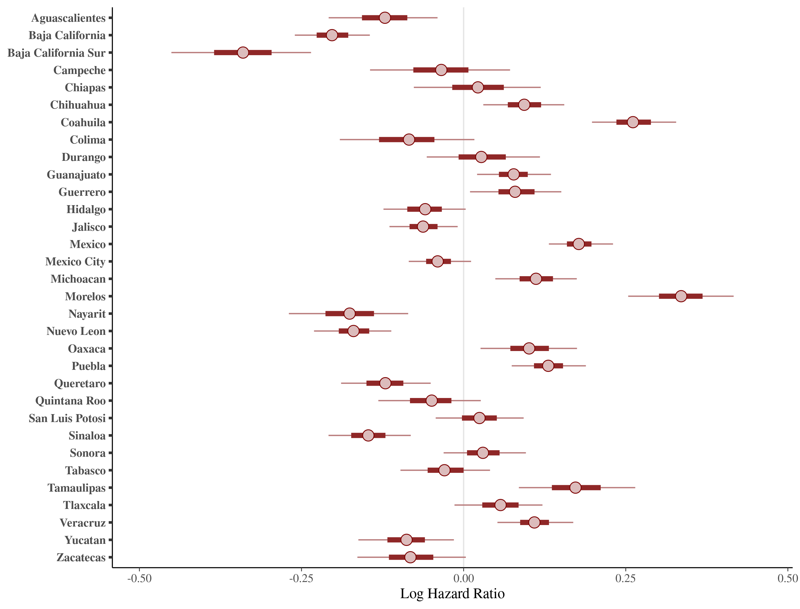
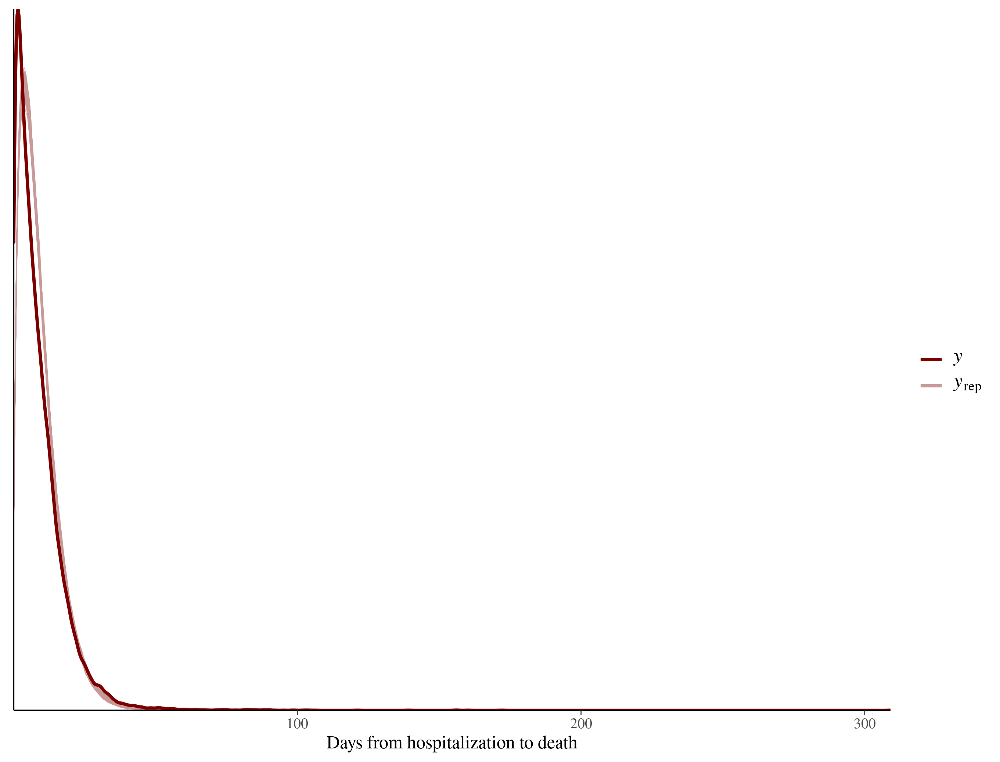
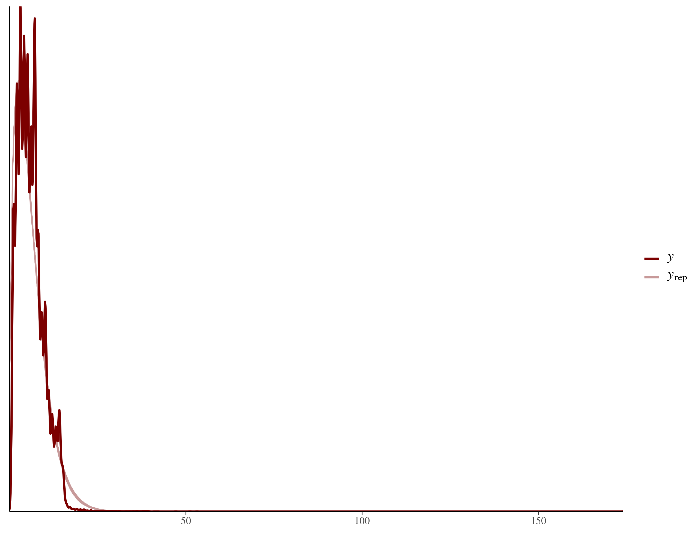
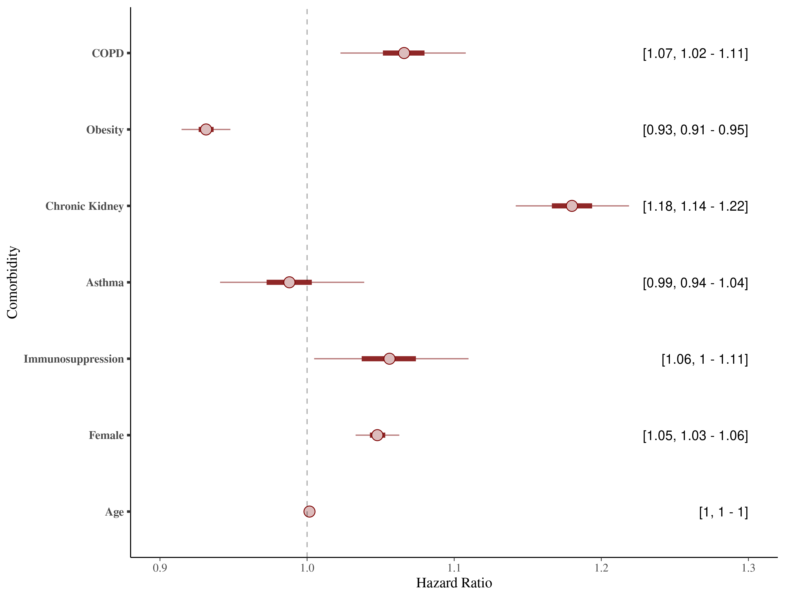

```{r setup, include=FALSE}
knitr::opts_chunk$set(echo = TRUE)
```

```{r packages, eval=FALSE, include=FALSE}
library(tableone)
```

# Appendix

## Model 1

```{r echo=FALSE}


```
**Figure 1.** Posterior predictive distribution density plot for deaths.
<br>
<br>
<br>
<br>


## Model 2

```{r echo=FALSE}
knitr::include_graphics("./CC2/jer1/ppc_plot_jer1_mort.png")

```
**Figure 2.** Posterior predictive distribution density plot for deaths.
<br>
<br>
<br>
<br>


```{r echo=FALSE}


```
**Figure 3.** Add caption.
<br>
<br>
<br>
<br>


## Model 3

```{r echo=FALSE}


```
**Figure 4.** Posterior predictive distribution density plot for deaths.
<br>
<br>
<br>
<br>


```{r echo=FALSE}


```
**Figure 5.** Posterior predictive distribution density plot for hospitalizations.
<br>
<br>
<br>
<br>


```{r echo=FALSE}


```
**Figure 6.** Add caption 
<br>
<br>
<br>
<br>


```{r echo=FALSE}


```
**Figure 7.** Add caption
<br>
<br>
<br>
<br>


```{r echo=FALSE}


```
**Figure 8.** Effect on time from hospitalization to death by covariates included in the third model.
<br>
<br>
<br>
<br>


```{r echo=FALSE}


```
**Figure 9.** Add caption
<br>
<br>
<br>
<br>


## Model 4

```{r echo =FALSE,fig.align='center'}


```
**Figure 10.** Log hazard rate for healthcare provider random effect (95% Credible Interval)
<br>
<br>
<br>
<br>


```{r echo =FALSE,fig.align='center'}


```
**Figure 11.** Add caption.
