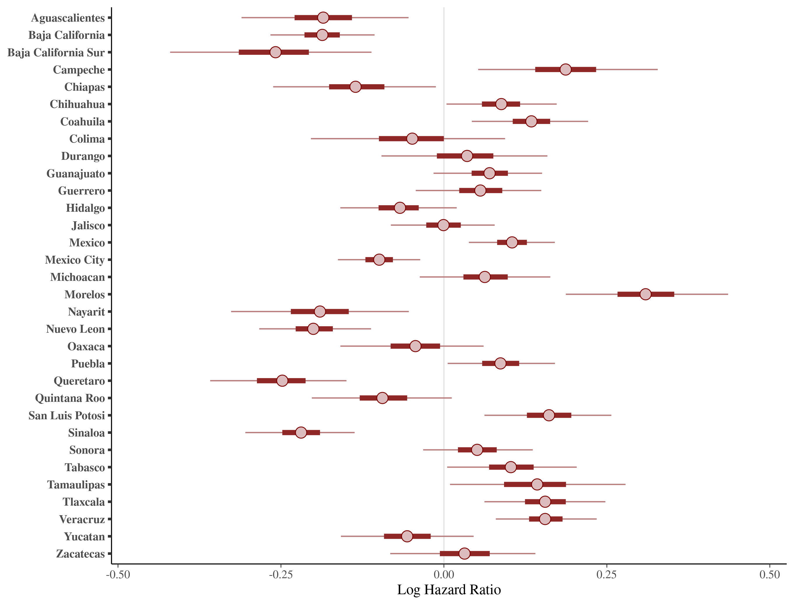
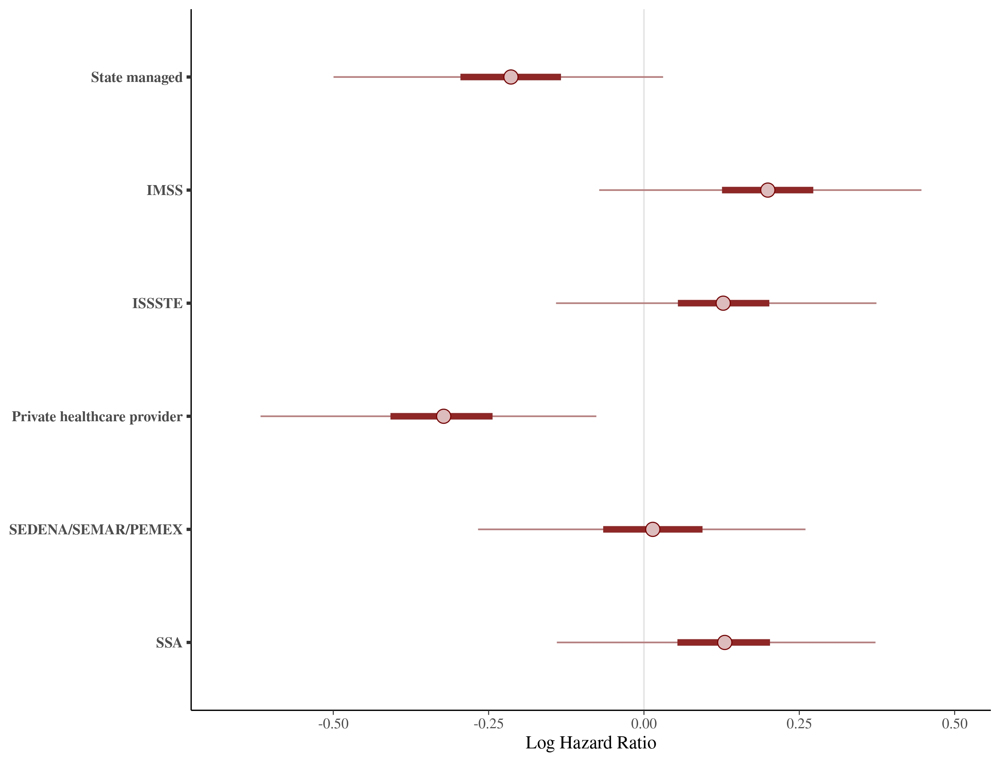
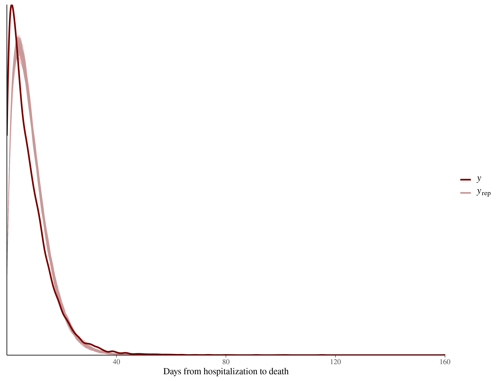

```{r setup, include=FALSE}
knitr::opts_chunk$set(echo = TRUE)
```

```{r packages, eval=FALSE, include=FALSE}
library(cmdstanr)
library(posterior)
library(bayesplot)
library(dplyr)
library(tidybayes)
library(readr)
library(rjson)
library(loo)
library(ggplot2)
library(tidyverse)

color_scheme_set("red")
datos=readRDS("Data/datos.rds")
mdat=datos$muerte
hdat=datos$hosp

```

```{r ppc_muertes_jer2, eval=FALSE, include=FALSE}

############
### jer2 ###
############

mod_jer2 <- cmdstan_model("./CC/jer2/ModeloJer2QR_quant.stan")

json_data_jer2 <- fromJSON(file="./Cmdstan/jer_2.json")

fit_jer2 <- mod_jer2$generate_quantities(c("./CC/jer2/jer2_1.csv","./CC/jer2/jer2_2.csv",
                                           "./CC/jer2/jer2_3.csv"), data = "./Cmdstan/jer_2.json",  
                                         parallel_chains = 3)

y_rep_mort=fit_jer2$draws("y_mort_tilde")
y_rep_mort=as_draws_matrix(y_rep_mort)
```

```{r loaded data, eval=FALSE, cache=TRUE, include=FALSE}
ppc = read_rds("./CC/ppc_m_jer2_&_jer2modi.rds")
y_rep_mort_jer2 = ppc$jer2
y_rep_mort_jer2modi = ppc$jer2modi

json_data_jer2 <- fromJSON(file="./Cmdstan/jer_2.json")
```

```{r ppc jer2, eval=FALSE, fig.cap="Predictive", cache=TRUE, include=FALSE}
ppc_plot_jer2_mort <- ppc_dens_overlay(json_data_jer2$y_mort,y_rep_mort_jer2) + 
  labs(x="Days from hospitalization to death")
ppc_plot_jer2_mort
```

```{r mcmc_intervals jer2, eval=FALSE, message=FALSE, warning=FALSE, cache=TRUE, include=FALSE}
color_scheme_set("red")

intervals_jer2=read_cmdstan_csv(files=c("./CC/jer2/jer2_1.csv",
                                        "./CC/jer2/jer2_2.csv",
                                        "./CC/jer2/jer2_3.csv"))

int_jer2_post=as_draws_matrix(intervals_jer2$post_warmup_draws)

ylabs_mu_l2_intervals_jer2 = str_replace_all(levels(mdat$SECTOR),c("ESTATAL" = "State managed",
                                                                   "SE_MAR_PE" = "SEDENA/SEMAR/PEMEX", 
                                                                   "SSA_OTROS" = "SSA",
                                                                   "PRIVADA"= "Private healthcare provider"))

mu_l2_intervals_jer2 = mcmc_intervals(int_jer2_post,regex_pars = "mu_l2\\W",prob_outer = .95) + 
  labs(x="Log Hazard Ratio") + 
  scale_y_discrete(labels=rev(ylabs_mu_l2_intervals_jer2),limits=rev)


mu_l_intervals_jer2 = mcmc_intervals(int_jer2_post,regex_pars = "mu_l\\W",prob_outer = .95) + 
  labs(x="Log Hazard Ratio") + 
  scale_y_discrete(labels=rev(c(levels(mdat$ENTIDAD_UM))),limits=rev)

mu_l2_intervals_jer2

mu_l_intervals_jer2

```


```{r eval=FALSE, include=FALSE}
##########################
### plots ppc jer2modi ###
##########################

y_rep_mort=fit_jer2modi$draws("y_mort_tilde")
y_rep_mort=as_draws_matrix(y_rep_mort)

ppc_plot_modi_mort <- ppc_dens_overlay(json_data_jer2modi$y_mort,y_rep_mort[1:200,]) + 
  labs(x="Days from hospitalization to death")

```

```{r mcmc_intervals jer2modi, eval=FALSE, message=FALSE, warning=FALSE, cache=TRUE, include=FALSE}
###############################
### mcmc intervals jer2modi ###
###############################

intervals_jer2modi=read_cmdstan_csv(files = 
                                      c("./CC/jer2modi/jer2modi_1.csv","./CC/jer2modi/jer2modi_2.csv",
                                        "./CC/jer2modi/jer2modi_3.csv"))

ylabs_mu_l2_intervals_jer2modi = str_replace_all(levels(mdat$SECENT),c("ESTATAL" = "State managed",
                                                                       "SE_MAR_PE" = "SEDENA/SEMAR/PEMEX", 
                                                                       "SSA_OTROS" = "SSA",
                                                                       "PRIVADA"= "Private healthcare provider"))

mu_l2_intervals_jer2modi <- mcmc_intervals(intervals_jer2modi$post_warmup_draws,regex_pars = c("mu_l2\\W"),prob_outer = .95) +
  ggplot2::labs( x="Log Hazard Ratio"
                 #,title = "Mu_l2 Jer2"
  ) +
  scale_y_discrete(labels=rev(ylabs_mu_l2_intervals_jer2modi),limits=rev)


mu_l_intervals_jer2modi <- mcmc_intervals(intervals_jer2modi$post_warmup_draws,regex_pars = c("mu_l\\W"),prob_outer = .95) +
  ggplot2::labs( x="Log Hazard Ratio"
                 #,title = "Mu_l2 Jer2"
  ) +
  scale_y_discrete(labels=rev(levels(mdat$ENTIDAD_UM)),limits=rev)
```

```{r eval=FALSE, fig.cap="Caption SECENT", cache=TRUE, include=FALSE}
mu_l2_intervals_jer2modi
```

```{r eval=FALSE, fig.cap="Caption ENTIDAD_UM", cache=TRUE, include=FALSE}
mu_l_intervals_jer2modi
```

```{r ppc jer2modi, eval=FALSE, fig.cap="Predictive", cache=TRUE, include=FALSE}
color_scheme_set("red")
json_data_jer2modi <- fromJSON(file="./Cmdstan/jer_2modi.json")

ppc_plot_modi_mort <- ppc_dens_overlay(json_data_jer2modi$y_mort,y_rep_mort_jer2modi) + 
  labs(x="Days from hospitalization to death")

ppc_plot_modi_mort
```

```{r eval=FALSE, include=FALSE}


```

```{r eval=FALSE, include=FALSE}


```

```{r eval=FALSE, include=FALSE}


```

```{r,fig.cap="Caption ENTIDAD_UM"}

```

```{r,fig.cap="Caption SECENT"}


```

```{r,fig.cap="Predictive distribution for deaths jer2modi"}


```
